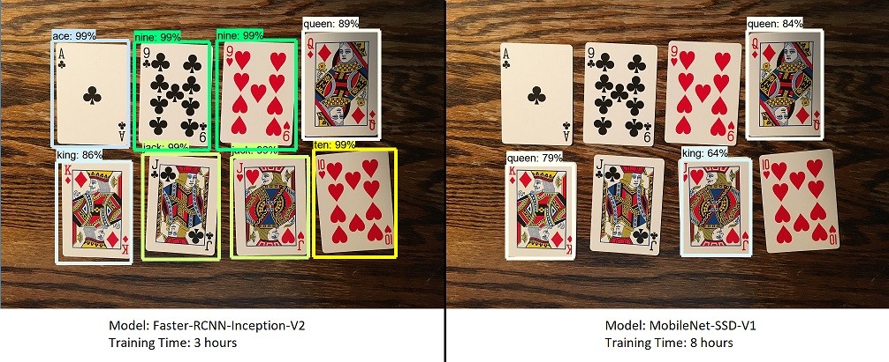
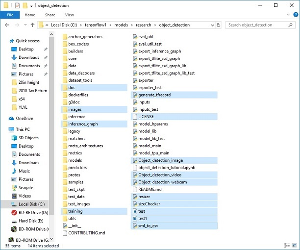
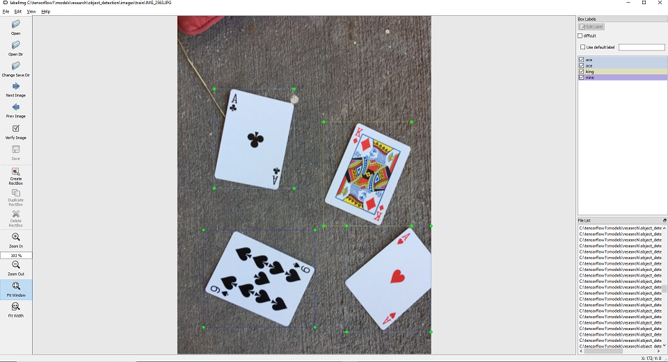
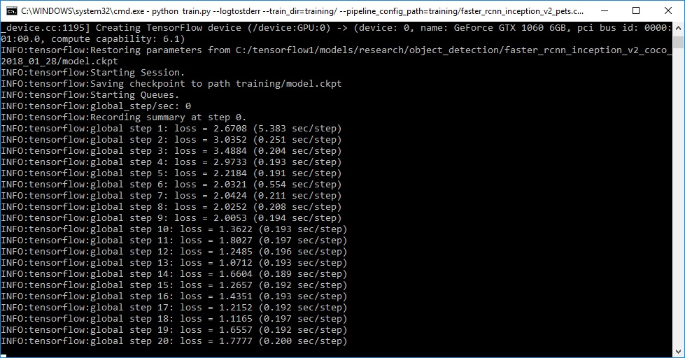
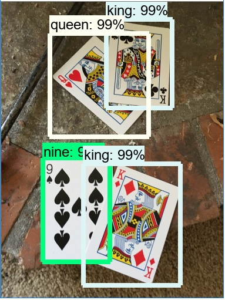

# How To Train an Object Detection Classifier for Multiple Objects Using TensorFlow (GPU) on Windows 10

## Brief Summary
*Last updated: 6/22/2019 with TensorFlow v1.13.1*

This repository is a tutorial for how to use TensorFlow's Object Detection API to train an object detection classifier for multiple objects on Windows 10, 8, or 7. (It will also work on Linux-based OSes with some minor changes.) It was originally written using TensorFlow version 1.5, but will also work for newer versions of TensorFlow.

I also made a YouTube video that walks through this tutorial. Any discrepancies between the video and this written tutorial are due to updates required for using newer versions of TensorFlow. 

**If there are differences between this written tutorial and the video, follow the written tutorial!**

[](https://www.youtube.com/watch?v=Rgpfk6eYxJA)

This readme describes every step required to get going with your own object detection classifier: 
1. [Installing Anaconda, CUDA, and cuDNN](https://github.com/EdjeElectronics/TensorFlow-Object-Detection-API-Tutorial-Train-Multiple-Objects-Windows-10#1-install-anaconda-cuda-and-cudnn)
2. [Setting up the Object Detection directory structure and Anaconda Virtual Environment](https://github.com/EdjeElectronics/TensorFlow-Object-Detection-API-Tutorial-Train-Multiple-Objects-Windows-10#2-set-up-tensorflow-directory-and-anaconda-virtual-environment)
3. [Gathering and labeling pictures](https://github.com/EdjeElectronics/TensorFlow-Object-Detection-API-Tutorial-Train-Multiple-Objects-Windows-10#3-gather-and-label-pictures)
4. [Generating training data](https://github.com/EdjeElectronics/TensorFlow-Object-Detection-API-Tutorial-Train-Multiple-Objects-Windows-10#4-generate-training-data)
5. [Creating a label map and configuring training](https://github.com/EdjeElectronics/TensorFlow-Object-Detection-API-Tutorial-Train-Multiple-Objects-Windows-10#5-create-label-map-and-configure-training)
6. [Training](https://github.com/EdjeElectronics/TensorFlow-Object-Detection-API-Tutorial-Train-Multiple-Objects-Windows-10#6-run-the-training)
7. [Exporting the inference graph](https://github.com/EdjeElectronics/TensorFlow-Object-Detection-API-Tutorial-Train-Multiple-Objects-Windows-10#7-export-inference-graph)
8. [Testing and using your newly trained object detection classifier](https://github.com/EdjeElectronics/TensorFlow-Object-Detection-API-Tutorial-Train-Multiple-Objects-Windows-10#8-use-your-newly-trained-object-detection-classifier)

[Appendix: Common Errors](https://github.com/EdjeElectronics/TensorFlow-Object-Detection-API-Tutorial-Train-Multiple-Objects-Windows-10#appendix-common-errors)

The repository provides all the files needed to train a "Pinochle Deck" playing card detector that can accurately detect nines, tens, jacks, queens, kings, and aces. The tutorial describes how to replace these files with your own files to train a detection classifier for whatever your heart desires. It also has Python scripts to test your classifier out on an image, video, or webcam feed.

<p align="center">
  
</p>

## Introduction
The purpose of this tutorial is to explain how to train your own convolutional neural network object detection classifier for multiple objects, starting from scratch. At the end of this tutorial, you will have a program that can identify and draw boxes around specific objects in pictures, videos, or in a webcam feed.

There are several good tutorials available for how to use TensorFlow’s Object Detection API to train a classifier for a single object. However, these usually assume you are using a Linux operating system. If you’re like me, you might be a little hesitant to install Linux on your high-powered gaming PC that has the sweet graphics card you’re using to train a classifier. The Object Detection API seems to have been developed on a Linux-based OS. To set up TensorFlow to train a model on Windows, there are several workarounds that need to be used in place of commands that would work fine on Linux. Also, this tutorial provides instructions for training a classifier that can detect multiple objects, not just one.

The tutorial is written for Windows 10, and it will also work for Windows 7 and 8. The general procedure can also be used for Linux operating systems, but file paths and package installation commands will need to change accordingly. I used TensorFlow-GPU v1.5 while writing the initial version of this tutorial, but it will likely work for future versions of TensorFlow.

TensorFlow-GPU allows your PC to use the video card to provide extra processing power while training, so it will be used for this tutorial. In my experience, using TensorFlow-GPU instead of regular TensorFlow reduces training time by a factor of about 8 (3 hours to train instead of 24 hours). The CPU-only version of TensorFlow can also be used for this tutorial, but it will take longer. If you use CPU-only TensorFlow, you do not need to install CUDA and cuDNN in Step 1. 

## Steps
### 1. Install Anaconda, CUDA, and cuDNN
Follow [this YouTube video by Mark Jay](https://www.youtube.com/watch?v=RplXYjxgZbw), which shows the process for installing Anaconda, CUDA, and cuDNN. You do not need to actually install TensorFlow as shown in the video, because we will do that later in Step 2. The video is made for TensorFlow-GPU v1.4, so download and install the CUDA and cuDNN versions for the latest TensorFlow version, rather than CUDA v8.0 and cuDNN v6.0 as instructed in the video. The [TensorFlow website](https://www.tensorflow.org/install/gpu) indicates which versions of CUDA and cuDNN are needed for the latest version of TensorFlow. 

If you are using an older version of TensorFlow, make sure you use the CUDA and cuDNN versions that are compatible with the TensorFlow version you are using. [Here](https://www.tensorflow.org/install/source#tested_build_configurations) is a table showing which version of TensorFlow requires which versions of CUDA and cuDNN.

Be sure to install [Anaconda](https://www.anaconda.com/distribution/#download-section) as instructed in the video, because the Anaconda virtual environment will be used for the rest of this tutorial. (Note: The current version of Anaconda uses Python 3.7, which is not officially supported by TensorFlow. However, when creating an Anaconda virtual environment during Step 2d of this tutorial, we will tell it to use Python 3.5.)

Visit [TensorFlow's website](https://www.tensorflow.org/install) for further installation details, including how to install it on other operating systems (like Linux). The [object detection repository](https://github.com/tensorflow/models/tree/master/research/object_detection) itself also has [installation instructions](https://github.com/tensorflow/models/blob/master/research/object_detection/g3doc/installation.md).

### 2. Set up TensorFlow Directory and Anaconda Virtual Environment
The TensorFlow Object Detection API requires using the specific directory structure provided in its GitHub repository. It also requires several additional Python packages, specific additions to the PATH and PYTHONPATH variables, and a few extra setup commands to get everything set up to run or train an object detection model. 

This portion of the tutorial goes over the full set up required. It is fairly meticulous, but follow the instructions closely, because improper setup can cause unwieldy errors down the road.

#### 2a. Download TensorFlow Object Detection API repository from GitHub
Create a folder directly in C: and name it “tensorflow1”. This working directory will contain the full TensorFlow object detection framework, as well as your training images, training data, trained classifier, configuration files, and everything else needed for the object detection classifier.

Download the full TensorFlow object detection repository located at https://github.com/tensorflow/models by clicking the “Clone or Download” button and downloading the zip file. Open the downloaded zip file and extract the “models-master” folder directly into the C:\tensorflow1 directory you just created. Rename “models-master” to just “models”.

**Note: The TensorFlow models repository's code (which contains the object detection API) is continuously updated by the developers. Sometimes they make changes that break functionality with old versions of TensorFlow. It is always best to use the latest version of TensorFlow and download the latest models repository. If you are not using the latest version, clone or download the commit for the version you are using as listed in the table below.**

 If you are using an older version of TensorFlow, here is a table showing which GitHub commit of the repository you should use. I generated this by going to the release branches for the models repository and getting the commit before the last commit for the branch. (They remove the research folder as the last commit before they create the official version release.)

| TensorFlow version | GitHub Models Repository Commit |
|--------------------|---------------------------------|
|TF v1.7             |https://github.com/tensorflow/models/tree/adfd5a3aca41638aa9fb297c5095f33d64446d8f |
|TF v1.8             |https://github.com/tensorflow/models/tree/abd504235f3c2eed891571d62f0a424e54a2dabc |
|TF v1.9             |https://github.com/tensorflow/models/tree/d530ac540b0103caa194b4824af353f1b073553b |
|TF v1.10            |https://github.com/tensorflow/models/tree/b07b494e3514553633b132178b4c448f994d59df |
|TF v1.11            |https://github.com/tensorflow/models/tree/23b5b4227dfa1b23d7c21f0dfaf0951b16671f43 |
|TF v1.12            |https://github.com/tensorflow/models/tree/r1.12.0 |
|TF v1.13            |https://github.com/tensorflow/models/tree/r1.13.0 |
|Latest version      |https://github.com/tensorflow/models |

This tutorial was originally done using TensorFlow v1.5 and this [GitHub commit](https://github.com/tensorflow/models/tree/079d67d9a0b3407e8d074a200780f3835413ef99) of the TensorFlow Object Detection API. If portions of this tutorial do not work, it may be necessary to install TensorFlow v1.5 and use this exact commit rather than the most up-to-date version.

#### 2b. Download the Faster-RCNN-Inception-V2-COCO model from TensorFlow's model zoo
TensorFlow provides several object detection models (pre-trained classifiers with specific neural network architectures) in its [model zoo](https://github.com/tensorflow/models/blob/master/research/object_detection/g3doc/detection_model_zoo.md). Some models (such as the SSD-MobileNet model) have an architecture that allows for faster detection but with less accuracy, while some models (such as the Faster-RCNN model) give slower detection but with more accuracy. I initially started with the SSD-MobileNet-V1 model, but it didn’t do a very good job identifying the cards in my images. I re-trained my detector on the Faster-RCNN-Inception-V2 model, and the detection worked considerably better, but with a noticeably slower speed.

<p align="center">
  
</p>

You can choose which model to train your objection detection classifier on. If you are planning on using the object detector on a device with low computational power (such as a smart phone or Raspberry Pi), use the SDD-MobileNet model. If you will be running your detector on a decently powered laptop or desktop PC, use one of the RCNN models. 

This tutorial will use the Faster-RCNN-Inception-V2 model. [Download the model here.](http://download.tensorflow.org/models/object_detection/faster_rcnn_inception_v2_coco_2018_01_28.tar.gz) Open the downloaded faster_rcnn_inception_v2_coco_2018_01_28.tar.gz file with a file archiver such as WinZip or 7-Zip and extract the faster_rcnn_inception_v2_coco_2018_01_28 folder to the C:\tensorflow1\models\research\object_detection folder. (Note: The model date and version will likely change in the future, but it should still work with this tutorial.)

#### 2c. Download this tutorial's repository from GitHub
Download the full repository located on this page (scroll to the top and click Clone or Download) and extract all the contents directly into the C:\tensorflow1\models\research\object_detection directory. (You can overwrite the existing "README.md" file.) This establishes a specific directory structure that will be used for the rest of the tutorial. 

At this point, here is what your \object_detection folder should look like:

<p align="center">
  
</p>

This repository contains the images, annotation data, .csv files, and TFRecords needed to train a "Pinochle Deck" playing card detector. You can use these images and data to practice making your own Pinochle Card Detector. It also contains Python scripts that are used to generate the training data. It has scripts to test out the object detection classifier on images, videos, or a webcam feed. You can ignore the \doc folder and its files; they are just there to hold the images used for this readme.

If you want to practice training your own "Pinochle Deck" card detector, you can leave all the files as they are. You can follow along with this tutorial to see how each of the files were generated, and then run the training. You will still need to generate the TFRecord files (train.record and test.record) as described in Step 4. 

You can also download the frozen inference graph for my trained Pinochle Deck card detector [from this Dropbox link](https://www.dropbox.com/s/va9ob6wcucusse1/inference_graph.zip?dl=0) and extract the contents to \object_detection\inference_graph. This inference graph will work "out of the box". You can test it after all the setup instructions in Step 2a - 2f have been completed by running the Object_detection_image.py (or video or webcam) script.

If you want to train your own object detector, delete the following files (do not delete the folders):
- All files in \object_detection\images\train and \object_detection\images\test
- The “test_labels.csv” and “train_labels.csv” files in \object_detection\images
- All files in \object_detection\training
-	All files in \object_detection\inference_graph

Now, you are ready to start from scratch in training your own object detector. This tutorial will assume that all the files listed above were deleted, and will go on to explain how to generate the files for your own training dataset.

#### 2d. Set up new Anaconda virtual environment
Next, we'll work on setting up a virtual environment in Anaconda for tensorflow-gpu. From the Start menu in Windows, search for the Anaconda Prompt utility, right click on it, and click “Run as Administrator”. If Windows asks you if you would like to allow it to make changes to your computer, click Yes.

In the command terminal that pops up, create a new virtual environment called “tensorflow1” by issuing the following command:
```
C:\> conda create -n tensorflow1 pip python=3.5
```
Then, activate the environment and update pip by issuing:
```
C:\> activate tensorflow1

(tensorflow1) C:\>python -m pip install --upgrade pip
```
Install tensorflow-gpu in this environment by issuing:
```
(tensorflow1) C:\> pip install --ignore-installed --upgrade tensorflow-gpu
```

(Note: You can also use the CPU-only version of TensorFow, but it will run much slower. If you want to use the CPU-only version, just use "tensorflow" instead of "tensorflow-gpu" in the previous command.)

Install the other necessary packages by issuing the following commands:
```
(tensorflow1) C:\> conda install -c anaconda protobuf
(tensorflow1) C:\> pip install pillow
(tensorflow1) C:\> pip install lxml
(tensorflow1) C:\> pip install Cython
(tensorflow1) C:\> pip install contextlib2
(tensorflow1) C:\> pip install jupyter
(tensorflow1) C:\> pip install matplotlib
(tensorflow1) C:\> pip install pandas
(tensorflow1) C:\> pip install opencv-python
```
(Note: The ‘pandas’ and ‘opencv-python’ packages are not needed by TensorFlow, but they are used in the Python scripts to generate TFRecords and to work with images, videos, and webcam feeds.)

#### 2e. Configure PYTHONPATH environment variable
A PYTHONPATH variable must be created that points to the \models, \models\research, and \models\research\slim directories. Do this by issuing the following commands (from any directory):
```
(tensorflow1) C:\> set PYTHONPATH=C:\tensorflow1\models;C:\tensorflow1\models\research;C:\tensorflow1\models\research\slim
```
(Note: Every time the "tensorflow1" virtual environment is exited, the PYTHONPATH variable is reset and needs to be set up again. You can use "echo %PYTHONPATH% to see if it has been set or not.)

#### 2f. Compile Protobufs and run setup.py
Next, compile the Protobuf files, which are used by TensorFlow to configure model and training parameters. Unfortunately, the short protoc compilation command posted on TensorFlow’s Object Detection API [installation page](https://github.com/tensorflow/models/blob/master/research/object_detection/g3doc/installation.md) does not work on Windows. Every  .proto file in the \object_detection\protos directory must be called out individually by the command.

In the Anaconda Command Prompt, change directories to the \models\research directory:
```
(tensorflow1) C:\> cd C:\tensorflow1\models\research
```

Then copy and paste the following command into the command line and press Enter:
```
protoc --python_out=. .\object_detection\protos\anchor_generator.proto .\object_detection\protos\argmax_matcher.proto .\object_detection\protos\bipartite_matcher.proto .\object_detection\protos\box_coder.proto .\object_detection\protos\box_predictor.proto .\object_detection\protos\eval.proto .\object_detection\protos\faster_rcnn.proto .\object_detection\protos\faster_rcnn_box_coder.proto .\object_detection\protos\grid_anchor_generator.proto .\object_detection\protos\hyperparams.proto .\object_detection\protos\image_resizer.proto .\object_detection\protos\input_reader.proto .\object_detection\protos\losses.proto .\object_detection\protos\matcher.proto .\object_detection\protos\mean_stddev_box_coder.proto .\object_detection\protos\model.proto .\object_detection\protos\optimizer.proto .\object_detection\protos\pipeline.proto .\object_detection\protos\post_processing.proto .\object_detection\protos\preprocessor.proto .\object_detection\protos\region_similarity_calculator.proto .\object_detection\protos\square_box_coder.proto .\object_detection\protos\ssd.proto .\object_detection\protos\ssd_anchor_generator.proto .\object_detection\protos\string_int_label_map.proto .\object_detection\protos\train.proto .\object_detection\protos\keypoint_box_coder.proto .\object_detection\protos\multiscale_anchor_generator.proto .\object_detection\protos\graph_rewriter.proto .\object_detection\protos\calibration.proto .\object_detection\protos\flexible_grid_anchor_generator.proto
```
This creates a name_pb2.py file from every name.proto file in the \object_detection\protos folder.

**(Note: TensorFlow occassionally adds new .proto files to the \protos folder. If you get an error saying ImportError: cannot import name 'something_something_pb2' , you may need to update the protoc command to include the new .proto files.)**

Finally, run the following commands from the C:\tensorflow1\models\research directory:
```
(tensorflow1) C:\tensorflow1\models\research> python setup.py build
(tensorflow1) C:\tensorflow1\models\research> python setup.py install
```

#### 2g. Test TensorFlow setup to verify it works
The TensorFlow Object Detection API is now all set up to use pre-trained models for object detection, or to train a new one. You can test it out and verify your installation is working by launching the object_detection_tutorial.ipynb script with Jupyter. From the \object_detection directory, issue this command:
```
(tensorflow1) C:\tensorflow1\models\research\object_detection> jupyter notebook object_detection_tutorial.ipynb
```
This opens the script in your default web browser and allows you to step through the code one section at a time. You can step through each section by clicking the “Run” button in the upper toolbar. The section is done running when the “In [ * ]” text next to the section populates with a number (e.g. “In [1]”). 

(Note: part of the script downloads the ssd_mobilenet_v1 model from GitHub, which is about 74MB. This means it will take some time to complete the section, so be patient.)

Once you have stepped all the way through the script, you should see two labeled images at the bottom section the page. If you see this, then everything is working properly! If not, the bottom section will report any errors encountered. See the [Appendix](https://github.com/EdjeElectronics/TensorFlow-Object-Detection-API-Tutorial-Train-Multiple-Objects-Windows-10#appendix-common-errors) for a list of errors I encountered while setting this up.

**Note: If you run the full Jupyter Notebook without getting any errors, but the labeled pictures still don't appear, try this: go in to object_detection/utils/visualization_utils.py and comment out the import statements on line 25 and 26 that include matplotlib. Then, try re-running the Jupyter notebook.**

<p align="center">
  
</p>

### 3. Gather and Label Pictures
Now that the TensorFlow Object Detection API is all set up and ready to go, we need to provide the images it will use to train a new detection classifier.

#### 3a. Gather Pictures
TensorFlow needs hundreds of images of an object to train a good detection classifier. To train a robust classifier, the training images should have random objects in the image along with the desired objects, and should have a variety of backgrounds and lighting conditions. There should be some images where the desired object is partially obscured, overlapped with something else, or only halfway in the picture. 

For my Pinochle Card Detection classifier, I have six different objects I want to detect (the card ranks nine, ten, jack, queen, king, and ace – I am not trying to detect suit, just rank). I used my iPhone to take about 40 pictures of each card on its own, with various other non-desired objects in the pictures. Then, I took about another 100 pictures with multiple cards in the picture. I know I want to be able to detect the cards when they’re overlapping, so I made sure to have the cards be overlapped in many images.

<p align="center">
  
</p>

You can use your phone to take pictures of the objects or download images of the objects from Google Image Search. I recommend having at least 200 pictures overall. I used 311 pictures to train my card detector.

Make sure the images aren’t too large. They should be less than 200KB each, and their resolution shouldn’t be more than 720x1280. The larger the images are, the longer it will take to train the classifier. You can use the resizer.py script in this repository to reduce the size of the images.

After you have all the pictures you need, move 20% of them to the \object_detection\images\test directory, and 80% of them to the \object_detection\images\train directory. Make sure there are a variety of pictures in both the \test and \train directories.

#### 3b. Label Pictures
Here comes the fun part! With all the pictures gathered, it’s time to label the desired objects in every picture. LabelImg is a great tool for labeling images, and its GitHub page has very clear instructions on how to install and use it.

[LabelImg GitHub link](https://github.com/tzutalin/labelImg)

[LabelImg download link](https://www.dropbox.com/s/tq7zfrcwl44vxan/windows_v1.6.0.zip?dl=1)

Download and install LabelImg, point it to your \images\train directory, and then draw a box around each object in each image. Repeat the process for all the images in the \images\test directory. This will take a while! 

<p align="center">
  
</p>

LabelImg saves a .xml file containing the label data for each image. These .xml files will be used to generate TFRecords, which are one of the inputs to the TensorFlow trainer. Once you have labeled and saved each image, there will be one .xml file for each image in the \test and \train directories.

### 4. Generate Training Data
With the images labeled, it’s time to generate the TFRecords that serve as input data to the TensorFlow training model. This tutorial uses the xml_to_csv.py and generate_tfrecord.py scripts from [Dat Tran’s Raccoon Detector dataset](https://github.com/datitran/raccoon_dataset), with some slight modifications to work with our directory structure.

First, the image .xml data will be used to create .csv files containing all the data for the train and test images. From the \object_detection folder, issue the following command in the Anaconda command prompt:
```
(tensorflow1) C:\tensorflow1\models\research\object_detection> python xml_to_csv.py
```
This creates a train_labels.csv and test_labels.csv file in the \object_detection\images folder. 

Next, open the generate_tfrecord.py file in a text editor. Replace the label map starting at line 31 with your own label map, where each object is assigned an ID number. This same number assignment will be used when configuring the labelmap.pbtxt file in Step 5b. 

For example, say you are training a classifier to detect basketballs, shirts, and shoes. You will replace the following code in generate_tfrecord.py:
```
# TO-DO replace this with label map
def class_text_to_int(row_label):
    if row_label == 'nine':
        return 1
    elif row_label == 'ten':
        return 2
    elif row_label == 'jack':
        return 3
    elif row_label == 'queen':
        return 4
    elif row_label == 'king':
        return 5
    elif row_label == 'ace':
        return 6
    else:
        None
```
With this:
```
# TO-DO replace this with label map
def class_text_to_int(row_label):
    if row_label == 'basketball':
        return 1
    elif row_label == 'shirt':
        return 2
    elif row_label == 'shoe':
        return 3
    else:
        None
```
Then, generate the TFRecord files by issuing these commands from the \object_detection folder:
```
python generate_tfrecord.py --csv_input=images\train_labels.csv --image_dir=images\train --output_path=train.record
python generate_tfrecord.py --csv_input=images\test_labels.csv --image_dir=images\test --output_path=test.record
```
These generate a train.record and a test.record file in \object_detection. These will be used to train the new object detection classifier.

### 5. Create Label Map and Configure Training
The last thing to do before training is to create a label map and edit the training configuration file.

#### 5a. Label map
The label map tells the trainer what each object is by defining a mapping of class names to class ID numbers. Use a text editor to create a new file and save it as labelmap.pbtxt in the C:\tensorflow1\models\research\object_detection\training folder. (Make sure the file type is .pbtxt, not .txt !) In the text editor, copy or type in the label map in the format below (the example below is the label map for my Pinochle Deck Card Detector):
```
item {
  id: 1
  name: 'nine'
}

item {
  id: 2
  name: 'ten'
}

item {
  id: 3
  name: 'jack'
}

item {
  id: 4
  name: 'queen'
}

item {
  id: 5
  name: 'king'
}

item {
  id: 6
  name: 'ace'
}
```
The label map ID numbers should be the same as what is defined in the generate_tfrecord.py file. For the basketball, shirt, and shoe detector example mentioned in Step 4, the labelmap.pbtxt file will look like:
```
item {
  id: 1
  name: 'basketball'
}

item {
  id: 2
  name: 'shirt'
}

item {
  id: 3
  name: 'shoe'
}
```

#### 5b. Configure training
Finally, the object detection training pipeline must be configured. It defines which model and what parameters will be used for training. This is the last step before running training!

Navigate to C:\tensorflow1\models\research\object_detection\samples\configs and copy the faster_rcnn_inception_v2_pets.config file into the \object_detection\training directory. Then, open the file with a text editor. There are several changes to make to the .config file, mainly changing the number of classes and examples, and adding the file paths to the training data.

Make the following changes to the faster_rcnn_inception_v2_pets.config file. Note: The paths must be entered with single forward slashes (NOT backslashes), or TensorFlow will give a file path error when trying to train the model! Also, the paths must be in double quotation marks ( " ), not single quotation marks ( ' ).

- Line 9. Change num_classes to the number of different objects you want the classifier to detect. For the above basketball, shirt, and shoe detector, it would be num_classes : 3 .
- Line 106. Change fine_tune_checkpoint to:
  - fine_tune_checkpoint : "C:/tensorflow1/models/research/object_detection/faster_rcnn_inception_v2_coco_2018_01_28/model.ckpt"

- Lines 123 and 125. In the train_input_reader section, change input_path and label_map_path to:
  - input_path : "C:/tensorflow1/models/research/object_detection/train.record"
  - label_map_path: "C:/tensorflow1/models/research/object_detection/training/labelmap.pbtxt"

- Line 130. Change num_examples to the number of images you have in the \images\test directory.

- Lines 135 and 137. In the eval_input_reader section, change input_path and label_map_path to:
  - input_path : "C:/tensorflow1/models/research/object_detection/test.record"
  - label_map_path: "C:/tensorflow1/models/research/object_detection/training/labelmap.pbtxt"

Save the file after the changes have been made. That’s it! The training job is all configured and ready to go!

### 6. Run the Training
**UPDATE 9/26/18:** 
*As of version 1.9, TensorFlow has deprecated the "train.py" file and replaced it with "model_main.py" file. I haven't been able to get model_main.py to work correctly yet (I run in to errors related to pycocotools). Fortunately, the train.py file is still available in the /object_detection/legacy folder. Simply move train.py from /object_detection/legacy into the /object_detection folder and then continue following the steps below.*

Here we go! From the \object_detection directory, issue the following command to begin training:
```
python train.py --logtostderr --train_dir=training/ --pipeline_config_path=training/faster_rcnn_inception_v2_pets.config
```
If everything has been set up correctly, TensorFlow will initialize the training. The initialization can take up to 30 seconds before the actual training begins. When training begins, it will look like this:

<p align="center">
  
</p>

Each step of training reports the loss. It will start high and get lower and lower as training progresses. For my training on the Faster-RCNN-Inception-V2 model, it started at about 3.0 and quickly dropped below 0.8. I recommend allowing your model to train until the loss consistently drops below 0.05, which will take about 40,000 steps, or about 2 hours (depending on how powerful your CPU and GPU are). Note: The loss numbers will be different if a different model is used. MobileNet-SSD starts with a loss of about 20, and should be trained until the loss is consistently under 2.

You can view the progress of the training job by using TensorBoard. To do this, open a new instance of Anaconda Prompt, activate the tensorflow1 virtual environment, change to the C:\tensorflow1\models\research\object_detection directory, and issue the following command:
```
(tensorflow1) C:\tensorflow1\models\research\object_detection>tensorboard --logdir=training
```
This will create a webpage on your local machine at YourPCName:6006, which can be viewed through a web browser. The TensorBoard page provides information and graphs that show how the training is progressing. One important graph is the Loss graph, which shows the overall loss of the classifier over time.

<p align="center">
  
</p>

The training routine periodically saves checkpoints about every five minutes. You can terminate the training by pressing Ctrl+C while in the command prompt window. I typically wait until just after a checkpoint has been saved to terminate the training. You can terminate training and start it later, and it will restart from the last saved checkpoint. The checkpoint at the highest number of steps will be used to generate the frozen inference graph.

### 7. Export Inference Graph
Now that training is complete, the last step is to generate the frozen inference graph (.pb file). From the \object_detection folder, issue the following command, where “XXXX” in “model.ckpt-XXXX” should be replaced with the highest-numbered .ckpt file in the training folder:
```
python export_inference_graph.py --input_type image_tensor --pipeline_config_path training/faster_rcnn_inception_v2_pets.config --trained_checkpoint_prefix training/model.ckpt-XXXX --output_directory inference_graph
```
This creates a frozen_inference_graph.pb file in the \object_detection\inference_graph folder. The .pb file contains the object detection classifier.

### 8. Use Your Newly Trained Object Detection Classifier!
The object detection classifier is all ready to go! I’ve written Python scripts to test it out on an image, video, or webcam feed.

Before running the Python scripts, you need to modify the NUM_CLASSES variable in the script to equal the number of classes you want to detect. (For my Pinochle Card Detector, there are six cards I want to detect, so NUM_CLASSES = 6.)

To test your object detector, move a picture of the object or objects into the \object_detection folder, and change the IMAGE_NAME variable in the Object_detection_image.py to match the file name of the picture. Alternatively, you can use a video of the objects (using Object_detection_video.py), or just plug in a USB webcam and point it at the objects (using Object_detection_webcam.py).

To run any of the scripts, type “idle” in the Anaconda Command Prompt (with the “tensorflow1” virtual environment activated) and press ENTER. This will open IDLE, and from there, you can open any of the scripts and run them.

If everything is working properly, the object detector will initialize for about 10 seconds and then display a window showing any objects it’s detected in the image!

<p align="center">
  
</p>

If you encounter errors, please check out the Appendix: it has a list of errors that I ran in to while setting up my object detection classifier. You can also trying Googling the error. There is usually useful information on Stack Exchange or in TensorFlow’s Issues on GitHub.

## Appendix: Common Errors
It appears that the TensorFlow Object Detection API was developed on a Linux-based operating system, and most of the directions given by the documentation are for a Linux OS. Trying to get a Linux-developed software library to work on Windows can be challenging. There are many little snags that I ran in to while trying to set up tensorflow-gpu to train an object detection classifier on Windows 10. This Appendix is a list of errors I ran in to, and their resolutions.

#### 1. ModuleNotFoundError: No module named 'deployment' or No module named 'nets'

This error occurs when you try to run object_detection_tutorial.ipynb or train.py and you don’t have the PATH and PYTHONPATH environment variables set up correctly. Exit the virtual environment by closing and re-opening the Anaconda Prompt window. Then, issue “activate tensorflow1” to re-enter the environment, and then issue the commands given in Step 2e. 

You can use “echo %PATH%” and “echo %PYTHONPATH%” to check the environment variables and make sure they are set up correctly.

Also, make sure you have run these commands from the \models\research directory:
```
setup.py build
setup.py install
```

#### 2. ImportError: cannot import name 'preprocessor_pb2'

#### ImportError: cannot import name 'string_int_label_map_pb2'

#### (or similar errors with other pb2 files)

This occurs when the protobuf files (in this case, preprocessor.proto) have not been compiled. Re-run the protoc command given in Step 2f. Check the \object_detection\protos folder to make sure there is a name_pb2.py file for every name.proto file.

#### 3. object_detection/protos/.proto: No such file or directory

This occurs when you try to run the
```
“protoc object_detection/protos/*.proto --python_out=.”
```
command given on the TensorFlow Object Detection API installation page. Sorry, it doesn’t work on Windows! Copy and paste the full command given in Step 2f instead. There’s probably a more graceful way to do it, but I don’t know what it is.

#### 4. Unsuccessful TensorSliceReader constructor: Failed to get "file path" … The filename, directory name, or volume label syntax is incorrect.
  
This error occurs when the filepaths in the training configuration file (faster_rcnn_inception_v2_pets.config or similar) have not been entered with backslashes instead of forward slashes. Open the .config file and make sure all file paths are given in the following format:
```
“C:/path/to/model.file”
```

#### 5. ValueError: Tried to convert 't' to a tensor and failed. Error: Argument must be a dense tensor: range(0, 3) - got shape [3], but wanted [].

The issue is with models/research/object_detection/utils/learning_schedules.py Currently it is
```
rate_index = tf.reduce_max(tf.where(tf.greater_equal(global_step, boundaries),
                                      range(num_boundaries),
                                      [0] * num_boundaries))
```
Wrap list() around the range() like this:

```
rate_index = tf.reduce_max(tf.where(tf.greater_equal(global_step, boundaries),
                                     list(range(num_boundaries)),
                                      [0] * num_boundaries))
```

[Ref: Tensorflow Issue#3705](https://github.com/tensorflow/models/issues/3705#issuecomment-375563179)

#### 6. ImportError: DLL load failed: The specified procedure could not be found.   (or other DLL-related errors)
This error occurs because the CUDA and cuDNN versions you have installed are not compatible with the version of TensorFlow you are using. The easiest way to resolve this error is to use Anaconda's cudatoolkit package rather than manually installing CUDA and cuDNN. If you ran into these errors, try creating a new Anaconda virtual environment:
```
conda create -n tensorflow2 pip python=3.5
```
Then, once inside the environment, install TensorFlow using CONDA rather than PIP:
```
conda install tensorflow-gpu
```
Then restart this guide from Step 2 (but you can skip the part where you install TensorFlow in Step 2d).
