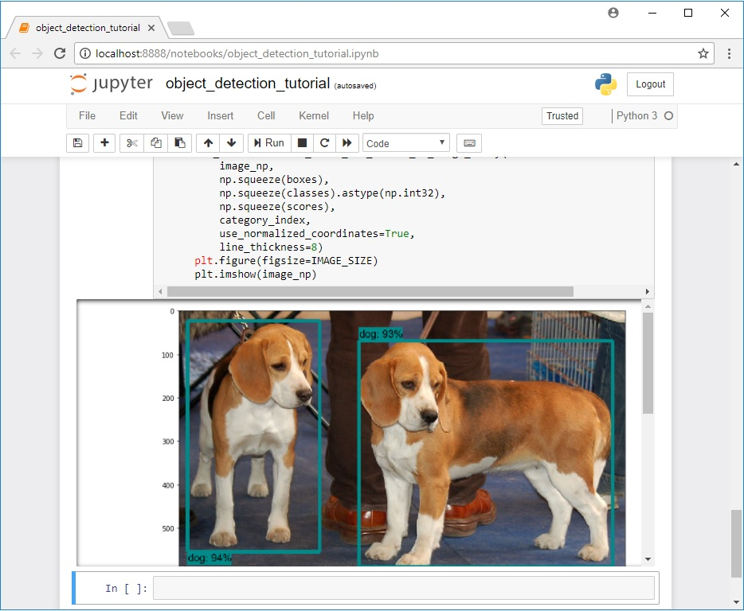

# Windows 10(GPU) 에서 TensorFlow를 사용하여 다중 사물 인식 학습을 하는 방법

## 간단한 요약
*마지막 업데이트: 9/26/2018 TensorFlow v1.10 사용*

*변환된 점: train.py 파일이 현재 /object_detection/legacy 폴더에 있으며 학습 전에는 반드시 메인 폴더로 옮겨야 합니다.*

이 Repository 는 Windows 10, 8 또는 7 에서 TensorFlow의 Object Detection API를 사용하여 많은 물체가 있는 환경에서 사물 인식 분류를 학습하기 위한 것입니다.( 조금만 바꾼다면 Linux기반의 운영체제에서도 돌아갑니다.)
기본적으로 TensorFlow 1.5 버전에서 작성되었으며, 더 높은 버전에서도 잘 작동 될 것입니다.(아마도?)

이 튜토리얼을 따라 Yotube 비디오를 만들었습니다. 튜토리얼과 비디오 사이의 다른 점은 TensorFlow 버전이 업데이트 되면서 발생한 것이다.
(잘 보면서 따라 하면 됩니다.)

**비디오랑 메뉴얼이랑 다르면 메뉴얼을 따라서 해주시면 되겠습니다!**

[](https://www.youtube.com/watch?v=Rgpfk6eYxJA)

이 readme는 커스텀 사물 인식 분류를 하기위해서 차례대로 따라 할 수 있게 표시 했습니다.:
1. [TensorFlow-GPU 설치방법](https://github.com/cocopambag/TensorFlow-Object-Detection-API-Tutorial-Train-Multiple-Objects-Windows-10#1-tensorflow-gpu-15--설치하기)
2. [Anaconda 가상 환경과 사물 인식 경로 설정](https://github.com/cocopambag/TensorFlow-Object-Detection-API-Tutorial-Train-Multiple-Objects-Windows-10#2-tensorflow-폴더와-anaconda-가상-환경-설정)
3. [사진(사물) 수집 및 라벨링](https://github.com/cocopambag/TensorFlow-Object-Detection-API-Tutorial-Train-Multiple-Objects-Windows-10#3-사진-수집-및-라벨링)
4. [학습 데이터 실행방법](https://github.com/cocopambag/TensorFlow-Object-Detection-API-Tutorial-Train-Multiple-Objects-Windows-10#4-학습-데이터-생성)
5. [label map 생성 및 학습 구성](https://github.com/cocopambag/TensorFlow-Object-Detection-API-Tutorial-Train-Multiple-Objects-Windows-10#5-label-map-생성-및-학습-준비)
6. [학습](https://github.com/cocopambag/TensorFlow-Object-Detection-API-Tutorial-Train-Multiple-Objects-Windows-10#6-학습-실행)
7. [학습된 그래프 추출](https://github.com/cocopambag/TensorFlow-Object-Detection-API-Tutorial-Train-Multiple-Objects-Windows-10#7-inference-graph-추출하기)
8. [학습된 사물 인식 그래프를 사용하고 테스트해보기](https://github.com/cocopambag/TensorFlow-Object-Detection-API-Tutorial-Train-Multiple-Objects-Windows-10#8-새로-학습된-사물-인식-분류기-사용하기!)

[부록: 에러 발생시](https://github.com/cocopambag/TensorFlow-Object-Detection-API-Tutorial-Train-Multiple-Objects-Windows-10#appendix--공통적인-에러)

이 repository는 9,10,잭,퀸,킹 그리고 에이스를 정확하게 구별할 수 있는 "Pinochle Deck"  카드 분류 학습에 필요한 모든 파일을 제공합니다. 본 튜터리얼은 사용자가 자신의 파일로 학습을 진행하고 싶을때 어떻게 파일들을 정리해야하는지 알려 줍니다. 사진, 비디오 또는 웹캠으로 학습이 잘 됐는지 파이썬 코드로 실행할 수 있습니다.

<p align="center">
  
</p>

## 소개
이 튜토리얼의 목적은 프로젝트를 시작하기전에 많은 사물에서 자신의 CNN 사물 인식 분류를 학습시키는지에 대해 설명하기 위함이다. 튜터리얼이 끝났을때,  사진,비디오 또는 웹캠으로 특정한 물체를 인식하고 boxing(박스를 그리는 것)을 하는 프로그램을 만들 수 있다.

TensorFlow의 사물 인식 API를 사용하여 하나의 물체를 구별하는 훈련법에 대한 좋고 많은 튜터리얼들이 있다. 그러나, 보통 Linux OS 환경을 사용해야 할 것이다.  학습을 위해 좋은 그래픽 카드를 설치한 성능 좋은 컴퓨터에 Linux 설치하는게 고민되면 이거 따라하시죵. 사물 인식 API가 Linux 기반 OS에서 개발되어야 하는 것 처럼 보일 꺼에요. WIndows 기반에서 TensorFlow를 학습 환경 설정을 위해서, Linux에서 작동하는 명령어 대신에 사용할 방법들이 있다. 또, 튜토리얼은 단 한 가지가 아니라 여러 사물을 인식하는 분류 학습에 대한 방법을 제공합니다.

튜토리얼은 windows 10 기반이지만 7이나 8에서도 잘 작동할 것입니다. Linux OS에서도 잘 작동할텐데, 대신에 명령어를 실행할 환경병수를 정확하게 바꾸면 됩니다.
( 추후에 Linux에서 실행하는 것도 올리겠습니다. - 번역자)

TensorFlow-GPU는 학습을 진행하는 동안 PC의 그래픽 카드가 제공하는 자원을 사용할 수 있게 합니다. 경험에 따르면, 일반적인 TensorFlow 대신에 TensorFlow-GPU를 사용하는 것이 학습 시간이 8분의 1로 줄어듭니다.(24시간이 3시간으로 변하는 마법이~). 일반적인 TensorFlow를 사용할 수 있지만 시간이 오래 걸릴 것입니다. 일반적인 TensorFlow를 사용하고 싶다면, 1단계에 있는 CUDA 와 cuDNN를 설치할 필요가 없습니다. 튜토리얼을 진행하면서 TensorFlow-GPU v1.5를 사용했으며, 더 높은 버전을 사용해도 잘 될 것입니다. 


## 단계들
### 1. TensorFlow-GPU 1.5  설치하기

(TensorFlow-GPU 1.5가 설치되어 있으면 통과해 주세요~)
Mark jay의 Youtube 영상의 지시들을 따라서 TensorFlow-GPU를 설치해 주세요 [Mark jay의 유튜브](https://www.youtube.com/watch?v=RplXYjxgZbw).

이 영상은 TensorFlow-GPU 1.4를 위해 만들어졌습니다. 따라서 "pip install --upgrade tensorflow-gpu" 명령어는 1.5 버전을 자동적으로 다운로드할 것입니다.(물론, 지금은 더 높은 버전이겠죵) CUDA 9.0과 cuDNN 7.0을 설치해주세요.(영상에서 CUDA 8.0과 cuDNN v7.0 설치하는 것을 따라하지 마세용), 왜냐하면 TensorFlow-GPU 1.5버전을 위한 버전이라서요. TensorFlow 버전이 높아지면 거기에 따라서 CUDA랑 cuDNN도 최신 버전으로 다운로드하세요

이 영상에서 설치하라는 Anaconda Python 3.6버전을 설치하세요, Anaconda 가상 환경을 사용하기 때문입니다. (저도 이때 처음 써봤어요!!)

Linux 같으 다른 OS에서 설치하는 법같이 자세한 사항은 옆의 TensorFlow's website [TensorFlow's website](https://www.tensorflow.org/install/install_windows)에 접속해주세요 옆의 사물 인식 repositoy [object detection repository](https://github.com/tensorflow/models/tree/master/research/object_detection)  또한 설치 방법 [installation instructions](https://github.com/tensorflow/models/blob/master/research/object_detection/g3doc/installation.md)을 포함하고 있습니다 

### 2. TensorFlow 폴더와 Anaconda 가상 환경 설정
TensorFlow 사물 인식 API는 GitHub에서 제공하는데, 특정한 디렉토리(경로) 구조를 사용합니다. 또한, 사물 인식 모델을 학습하고 설정하기 위해  추가적인 Python 패키지, 특정한 PATH와 PYTHONPATH 변수 추가 그리고 몇가지 설치 명령어가 필요합니다.

튜토리얼에서 이부분은 요구되는 모든 것을 설치합니다. 설치를 잘못하면 오류가 많이 발생하기 때문에 매우 신중하게 해야하고 지시사항이랑 거의 똑같게 해야합니다. (정말입니다.. 여기서 실수한번해서 처음부터 다시 했습니다^^)

#### 2a. TensorFlow Object Detection API GitHub에서 repository 다운로드하기
C: 에서 "tensorflow1"이라는 폴더를 생성하세요. TensorFlow 물체 인식 프레임워크 뿐만 아니라 학습 이미지, 학습데이터, 학습 분류기, 구성 파일, 그리고 사물 인식 분류에 필요한 모든 것이 포함 될 것입니다.

"Clone or Download" 버튼 과 zip 파일을 다운로드를 클릭해서 https://github.com/tensorflow/models 에 있는 TensorFlow 사물 인식 repository 전체를 다운로드하세요. zip 파일을 열고 "models-master" 폴더를 C:\tensorflow1 폴더로 이동시키고 "models" 라는 폴더명으로 바꾸세요.
(Note : 튜토리얼은 [GitHub commit](https://github.com/tensorflow/models/tree/079d67d9a0b3407e8d074a200780f3835413ef99)을 사용했습니다. 만약 어느 부분이 안된다면, 최신 버전을 다운 받아서 그럴 것입니다.)

#### 2b. TensorFlow의 model zoo 에 있는 Faster-RCNN-Inception-V2-COCO 모델 다운로드 하기
TensorFlow는 [model zoo](https://github.com/tensorflow/models/blob/master/research/object_detection/g3doc/detection_model_zoo.md) 라는 것에서 몇개의 사물 인식 모델을 제공합니다. ( 특정한 신경망 구족로 미리 학습된 분류기 입니다.)  어떤 모델(SSD-MobileNet 같은 모델) 은 정확도는 낮지만 빠른 탐색기능을 가지고 있으며, 반면에 어떤 모델( Faster-RCNN 같은 모델) 은 정확도는 높지만 느린 탐색 기능을 가지고 있습니다. 처음에는 SSD-MobileNet-V1 모델을 사용했지만, 카드들을 인식 시키는데에 적합하지 않았습니다. Faster-RCNN-Inception-V2로 재학습 했으며 눈에 보일정도로 느렸지만, 제법 잘 작동했습니다.
(밑에는 예제 사진 입니다.)

<p align="center">
  
</p>

학습을 하는데 적합한 모델을 찾아서 적용하세요. 연산능력이 낮은 기기(스마트 폰이나 라즈베리 파이같은) 에서 사물 인식을 한다면, SDD-MobileNet 모델을 사용하세요. 만약 노트북이나 데스크탑을 사용한다면 RCNN 모델을 사용하세요.
(저는 이걸 안읽고 라즈베리에 적용시키려다가 망했습니다 ㅠㅠ...)

이 튜토리얼은 Faster-RCNN-Inception-V2 모델을 사용할 것입니다. [여기서 다운로드 받으세요](http://download.tensorflow.org/models/object_detection/faster_rcnn_inception_v2_coco_2018_01_28.tar.gz) 
faster_rcnn_inception_v2_coco_2018_01_28.tar.gz을 다운로드 받고 zip을 해제하고 faster_rcnn_inception_v2_coco_2018_01_28 를 C:\tensorflow1\models\research\object_detection 폴더로 옮기세요.
(Note: 모델 날짜와 버전이 바뀔 수 있지만, 튜토리얼에서 잘 작동할 것입니다.)

#### 2c. GitHub에서 튜토리얼의 repository를 다운로드 하세요
이 페이지에 있는 전체 repository(위에 보시면 Clone 또는 Download가 있습니다.) 를 다운로드하고 해제한 뒤에 C:\tensorflow1\models\research\object_detection 폴더로 옮기세요.
("README.md"파일을 수정할 수 있습니다.
이 폴더에서 튜토리얼 대부분을 사용할 것입니다.

여기서, object_detectio 폴더는 밑에와 같이 보여야 합니다.

<p align="center">
  
</p>

이 repository는 "pinochle Deck" 카드 분류기 학습에 필요한 이미지, 분류 데이터, csv파일들, 그리고 TFRecord들이 포함되어 있습니다.이 이미지들과 데이터들을 사용하여 자신만의 Pinochle 카드 분류기 만들기를 연습할 수 있습니다. 또한, 학습 데이터를 작동시키는 Python 코드도 포함 되어 있습니다. 이미지들, 영상들 또는 웹캠으로 사물 인식을 테스트 할 수 잇는 코드를 포합하고 있습니다. 이 파일에서 doc 폴더와 안의 내용을 무시해도 됩니다.그것들은  readme에서 사용된 이미지들을 포함하고 있습니다.

만약 나만의 "Pinochle Deck" 카드 분류기 학습을 연습하고 싶다면, 모든 파일들을 그대로 두면 된다. 각 파일들이 작동되는 법과 학습하는 것을 보고 싶다면 튜토리얼을 따라하면 된다. Step4에 표시된 것 처럼 TFRecord 파일들(train.record 와 test.record)을 작동하는 것이다. 

Pinochle Deck 카드 분류기를 위한 frozen inference graph를 [Dropbox](https://www.dropbox.com/s/va9ob6wcucusse1/inference_graph.zip?dl=0)에서 다운로드 해야하고 object_detection\inference_graph를 풀어야한다.  이 inference graph는  boxing으로 동작할 것이다. 2a에서 2f까지 모든 지시 사항은 Object_detection_image.py(또는 영상 또는 웹캠) 이 동작하면 제대로 한 것이다.

만약 커스텀 사물 인식 분류기를 학습하고 싶다면 , 밑의 파일들을 삭제해야 합니다.(폴더 삭제xxxx) :
-  \object_detection\images\train 과 \object_detection\images\test 에 있는 모든 파일들
-  \object_detection\images 안에 있는 "test_labels.csv" 과 "train_labels.csv" 파일들
-  \object_detection\training의 모든 파일들
-  \object_detection\inference_graph의 모든 파일들

Now, you are ready to start from scratch in training your own object detector. This tutorial will assume that all the files listed above were deleted, and will go on to explain how to generate the files for your own training dataset.

#### 2d. 새로운 Anaconda 가상 환경 설정
다음으로, tensorflow-gpu를 위해 anaconda 가상 환경을 설정해야 합니다. Windows의 시작 메뉴에서 Anaconda Prompt utility를 찾고 마우스 오른쪽 버튼을 클릭하고, "관리자로 실행"을 클릭하세요. Windows에서 정말로 실행할 것인지 물어본다면, "네"를 누르세용 ( 큰일 안납니다)

명령창을 키고, 밑의 명령어를 따라서 "tensorflow1"라는 새로운 가상환경을 생성하세요 (cmd 창 아닙니다. anaconda의 명령창입니다. ) :

​```
C:\> conda create -n tensorflow1 pip python=3.5
​```

그런 다음, 환경을 활성화 합니다:

​```
C:\> activate tensorflow1
​```

이 환경에서 tensorflow-gpu를 설치합니다::

​```
(tensorflow1) C:\> pip install --ignore-installed --upgrade tensorflow-gpu
​```

밑의 명령어들로 필수적인 패키지들을 설치합니다 :

​```
(tensorflow1) C:\> conda install -c anaconda protobuf
(tensorflow1) C:\> pip install pillow
(tensorflow1) C:\> pip install lxml
(tensorflow1) C:\> pip install Cython
(tensorflow1) C:\> pip install jupyter
(tensorflow1) C:\> pip install matplotlib
(tensorflow1) C:\> pip install pandas
(tensorflow1) C:\> pip install opencv-python
​```

(Note: "pandas" 와 "opencv-python" 패키지들은 TensorFlow에 필요한 것은 아니지만, 나중에 TFRecord들과 이미지, 영상, 웹캠을 작동하는 파이선 코드에 사용됩니다.)

#### 2e.PYTHONPATH 환경 변수 설정 
PYTHONPATH 변수에 \models, \models\research, 그리고 \models\research\slim 경로를 반드시 설정해야 합니다. 밑에 있는 명령어를 실행하세요 (어떤 폴더에서든 상관 없습니다.) :

​```
(tensorflow1) C:\> set PYTHONPATH=C:\tensorflow1\models;C:\tensorflow1\models\research;C:\tensorflow1\models\research\slim
​```

(Note: PYTHONPATH는 Anaconda 실행창을 다시 킬 때마다 설정해줘야 합니다.)

#### 2f. Protobuf을 컴파일 및 setup.py을 실행하기
다음으로, 모델과 학습에 필요한 파라미터 설정에 사용하기 위해서 Protobuf 파일들을 컴파일 합니다. Windows에서는 짧은 명령어로 작동하지 않습니다...  [installation page](https://github.com/tensorflow/models/blob/master/research/object_detection/g3doc/installation.md). \object_detection\protos에 있는모든  .proto 파일을 명령어로 각각 실행해야 합니다.

Anaconda 명령창에서, \models\research로 옮기고 밑의 명령어를 복사 붙혀넣기하고 실행하세요

​```
protoc --python_out=. .\object_detection\protos\anchor_generator.proto .\object_detection\protos\argmax_matcher.proto .\object_detection\protos\bipartite_matcher.proto .\object_detection\protos\box_coder.proto .\object_detection\protos\box_predictor.proto .\object_detection\protos\eval.proto .\object_detection\protos\faster_rcnn.proto .\object_detection\protos\faster_rcnn_box_coder.proto .\object_detection\protos\grid_anchor_generator.proto .\object_detection\protos\hyperparams.proto .\object_detection\protos\image_resizer.proto .\object_detection\protos\input_reader.proto .\object_detection\protos\losses.proto .\object_detection\protos\matcher.proto .\object_detection\protos\mean_stddev_box_coder.proto .\object_detection\protos\model.proto .\object_detection\protos\optimizer.proto .\object_detection\protos\pipeline.proto .\object_detection\protos\post_processing.proto .\object_detection\protos\preprocessor.proto .\object_detection\protos\region_similarity_calculator.proto .\object_detection\protos\square_box_coder.proto .\object_detection\protos\ssd.proto .\object_detection\protos\ssd_anchor_generator.proto .\object_detection\protos\string_int_label_map.proto .\object_detection\protos\train.proto .\object_detection\protos\keypoint_box_coder.proto .\object_detection\protos\multiscale_anchor_generator.proto .\object_detection\protos\graph_rewriter.proto
​```

 \object_detection\protos 폴더에 모든 "name.proto"에 해당하는 "name_pb2.py" 파일이 생성 될 것입니다.

**(Note: 가끔씩 TensorFlow에서 새로운 .proto 파일을 \protos 폴더에 추가할 것입니다. 만약에 ImportError: cannot import name 'somethin_something_pb2' 에러가 발생한다면, protoc 명령창에 새로운 .proto 파일들을 입력해줘야 합니다.)**

마지막으로, C:\tensorflow1\models\research 에서 밑의 명령어를 실행해 주세요 :

​```
(tensorflow1) C:\tensorflow1\models\research> python setup.py build
(tensorflow1) C:\tensorflow1\models\research> python setup.py install
​```

#### 2g. TensorFlow 설치가 잘 되었는지 테스트 하기
TensorFlow Obkect Detection API는 미리 학습된 모델을 사용하거나 새로 학습을 시킬 수 있다. 모델을 테스트 할 수 있는데 Jupyter를 통해서 object_detection_tutorial.ipynb 코드를 실행해서 볼 수 있다.  Object_detection 폴더로 가서 밑의 명령어를 실행하면 된다 :


​```
(tensorflow1) C:\tensorflow1\models\research\object_detection> jupyter notebook object_detection_tutorial.ipynb
​```

다르 웹 브라우저를 열고 차례대로 실행 시킬 수 있는 화면이 나올 것 입니다.  위쪽에 있는 툴바에서 "Run" 버튼을 클릭해서 각 구역을 차례로 실행할 수 있습니다. “In [ * ]”는 그 구역이 완료되었고 다음 구역으로 갈 수 있는 표시이다.(e.g. “In [1]” ) 

(Note: ssd_mobilenet_v1 모델은 약 74MB가 필요합니다. 이 모델은 시간이걸리니 조금 기다려 봅니다.)

모든 코드를 차례대로 실행하면, 한 페이지에서 두 개의 라벨링된 이미지를 볼 수 있습니다. 이미지가 잘 나온다면 완벽하게 실행한 것입니다! 그렇지 않다면, 어떤 에러가 뜰 것입니다. 오류가 발생한다면 [부가설명](https://github.com/cocopambag/TensorFlow-Object-Detection-API-Tutorial-Train-Multiple-Objects-Windows-10#Appendix:--공통적인-에러) 을 읽어 주세요.


<p align="center">
  
</p>

### 3. 사진 수집 및 라벨링
TensorFlow Object Detection API 설치가 완료 되었고 사용할 준비가 되었습니다. 새로운 분류기를 학습하기 위해서 이미지 파일이 필요합니다.


#### 3a. 사진 수집
TensorFlow는 좋은 분류기를 학습하기 위해서는 백여장의 사진이 필요합니다. 좋은 분류기를 학습하기 위해서, 원하는 사물이 포함된 사진에 여러가지 물체가 있어야 하며, 다양한 배경과 조명에서 수집 해야합니다.  어떤 사진은 원하는 사물이 반쯤 가려져 있거나 다른 사물과 겹쳐져 있어야 합니다.

PinochleCard 분류기를 위해서, 6개의 다른 모양을 사용했습니다( 9, 10, 잭, 퀸, 킹, 그리고 에이스 카드). 저는 iPhone으롤 각 모양의 사진 약 40장을 사용했으며, 다양한 물체들과 같이 있는 사진을 사용했습니다. 그런 후에, 약 100장의 섞여 있는 카드 사진을 사용했습니다. 다른 카드나 사물이랑 섞여 있을 때도 인식하고 싶어서, 겹쳐져있거나 섞인 사진을 사용했습니다.


<p align="center">
  
</p>

직접 사진을 찍거나 구글 이미지 검색에서 다운로드하여 사용할 수 도 있습니다. 최소한 200장의 사진을 사용하는 것을 추천합니다. 저는 311장의 사진을 사용했습니다.

사진이 너무 크면 안됩니다. 200KB보다 적어야 하며, 720x1280 크기보다는 작아야 합니다. 이미지가 너 무크면 학습 시간이 길어집니다. repository에 있는 resizer.py를 사용하면 크기를 재조정할 수 있습니다.

사진을 다 모은 뒤에,  20%를 \object_detection\images\test 폴더로, 80%를 \object_detection\images\train 폴더로 옮깁니다.  test 그리고\train 폴더에 다양한 사진을 넣어야 합니다.

#### 3b. 사진 라벨링( 라벨 어노테이션 )
자 제일 재밌는 부분입니다! ( 전.. 제일 노가다라고 생각합니다. ) 모든 사진들을 모은 뒤에, 사진들에 라벨을 달아주는 부분입니다. LabelImg 는 사진을 라벨링하는 좋은 툴이며, GitHub 페이지에 설치와 사용법이 자세히 설명되어 있습니다.

[LabelImg GitHub link](https://github.com/tzutalin/labelImg)

[LabelImg download link](https://www.dropbox.com/s/tq7zfrcwl44vxan/windows_v1.6.0.zip?dl=1)

LabeImg를 서칠한 뒤, \images\train 폴더로 경로를 설정하고, 각 사진에서 원하는 사물에 박스를 그리면 됩니다. ( 노가다 입니다 노가다...) \images\test에 있는 사진들도 반복해서 진행합니다. 끝나면 밑의 사진처럼 되있을 것입니다 !

<p align="center">
  
</p>

LabelImg 는 각 사진에서 분류 데이터를 포함한 xml 파일로 저장합니다. 이 xml 파일들은 TensorFlow 학습 입력들 중 하나 인 TFRecords에서 사용될 것입니다. 각 이미지를 분류하고 저장한 후에, 각 \test 와 \train 경로에 각 이미지마다 하나의 xml 파일이 있을 것입니다.

또한, sizeChecker.py를 실행해서 박스를친 부분이 학습에 사용될 데이터로 적절한지 체크합니다.
밑의 명령어를 실행 하세요.

​```
(tensorflow1) C:\tensorflow1\models\research\object_detection> python sizeChecker.py --move
​```

### 4. 학습 데이터 생성
사진들이 라벨링이 끝난 후, TensorFlow 학습 모델의 입력 데이터로 사용될 TFRecords를 생성하는 부분 입니다. 이 튜토리얼에서는 [Dat Tran’s Raccoon Detector dataset](https://github.com/datitran/raccoon_dataset)의 xml_to_csv.py 그리고 generate_tfrecord.py 코드를 사용하며, 파일 경로를 조금 수정할 것입니다. 

먼저, 모든 train과 test 폴더에 있는 이미지들이 포함된 xml 데이터를 csv 파일로 바꿀 것입니다. \object_detection 폴더에서, anaconda 명령창에서 밑의 명령어를 실행하세요 :

​```
(tensorflow1) C:\tensorflow1\models\research\object_detection> python xml_to_csv.py
​```
 \object_detection\images 폴더에 train_labels.csv 과 test_labels.csv 가 생성될 것입니다.

그 후에, generate_tfrecord.py를 텍스트 편집기로 열어봅니다. 31번째 줄에 각 사물에 맞는 ID 번호가 적혀진 라벨 맵을 바꿔야 합니다. 단계 5b에 있는 labelmap.pbtxt 파일과 같은 갯수여야 합니다.

예를들어, 9, 10, 잭, 퀸, 킹, 에이스에 대한 분류기를 학습하는 예제는 밑에 generate_tfrecord.py로 바꿔야 합니다:


# TO-DO labelmap 수정
​```
def class_text_to_int(row_label):
    if row_label == 'nine':
        return 1
    elif row_label == 'ten':
        return 2
    elif row_label == 'jack':
        return 3
    elif row_label == 'queen':
        return 4
    elif row_label == 'king':
        return 5
    elif row_label == 'ace':
        return 6
    else:
        return None
​```
밑은 농구공, 셔츠, 신발에 관한 것:


# TO-DO replace this with label map

​```
def class_text_to_int(row_label):
    if row_label == 'basketball':
        return 1
    elif row_label == 'shirt':
        return 2
    elif row_label == 'shoe':
        return 3
    else:
        return None
​```
그 후에, \object_detection 폴더에서 TFRecord 파일을 생성하기 위해 밑의 명령어를 실행하세용:

​```
python generate_tfrecord.py --csv_input=images\train_labels.csv --image_dir=images\train --output_path=train.record
python generate_tfrecord.py --csv_input=images\test_labels.csv --image_dir=images\test --output_path=test.record
​```

이 코드는 \object_detection폴더에서 train.record 과 test.record 파일을 생성합니다. 새로운 사물 인식 분류기를 학습하는데 사용될 것입니다.


### 5. Label Map 생성 및 학습 준비
학습을 진행하기 마지막에 label map을 생성하고 학습 준비 파일을 수정합니다.

#### 5a. Label map
label map은 각 사물과 클래스 숫자를 맵핑시킨 것 입니다.  C:\tensorflow1\models\research\object_detection\training 폴더에서 텍스트 편집기를 사용하여 새로운 파일을 만들고 labelmap.pbtxt 이름으로 저장하세요. (.txt 가아니라 .pbtxt 입니다!!) 텍스트 편집기를 켜고, 밑의 형식으로 복사 붙혀넣기 하세요. (밑의 예제는 Pinochle Deck Card Detector에 관한 것입니다.) :

​```
item {
  id: 1
  name: 'nine'
}

item {
  id: 2
  name: 'ten'
}

item {
  id: 3
  name: 'jack'
}

item {
  id: 4
  name: 'queen'
}

item {
  id: 5
  name: 'king'
}

item {
  id: 6
  name: 'ace'
}

​```

label map ID 숫자들은 generate_tfrecord.py 파일에서 정의한 것과 같아야 합니다. 단계 4에서 본 농구공, 셔츠 그리고 신발 분류기에 대한 예제는 밑의 labelmap.pbtxt와 같습니다:

​```
item {
  id: 1
  name: 'basketball'
}

item {
  id: 2
  name: 'shirt'
}

item {
  id: 3
  name: 'shoe'
}
​```

#### 5b. 학습 구성하기
마침내, 사물 인식 학습 경로를 구성해야 합니다. 학습에 사용될 모델과 파라미터를 정의하는 것입니다. 학습을 시작하기 전의 마지막 단계 입니다!!

C:\tensorflow1\models\research\object_detection\samples\configs 으로 이동하고 faster_rcnn_inception_v2_pets.config 파일을 복사해서 \object_detection\training 폴더로 옮기세요. 그 후에, 테스트 에디터로 파일을 엽니다. 클래스와 예제의 수, 그리고 학습데이터에 파일 경로를 더하는 수정을 합니다.

faster_rcnn_inception_v2_pets.config 파일을 밑에 처럼 변경하세요.
(Note: 경로 설정시 백슬레쉬(\)가 아니라 포어워슬레쉬(/)를 하세요. 또, TensorFlow 학습시 에러가 발생하면 경로 설정에서 작은 따움표(')가 아니라 큰 따움표(")로 해야합니다.)

- Line 9. 사물 인식을 할 때 인식할 사물 갯수로 num_classes 변수를 바꿔주세요. 
- Line 110.  fine_tune_checkpoint 변경:
  - fine_tune_checkpoint : "C:/tensorflow1/models/research/object_detection/faster_rcnn_inception_v2_coco_2018_01_28/model.ckpt"

- Lines 126 and 128. train_input_reader 부분에서 input_path 와 label_map_path 변경 :
  - input_path : "C:/tensorflow1/models/research/object_detection/train.record"
  - label_map_path: "C:/tensorflow1/models/research/object_detection/training/labelmap.pbtxt"

- Line 132. num_examples 변수를 \images\test 에 있는 이미지 갯수로 설정해주세요.

- Lines 140 and 142. eval_input_reader 부분에서 input_path와 label_bap_path 변경 :
  - input_path : "C:/tensorflow1/models/research/object_detection/test.record"
  - label_map_path: "C:/tensorflow1/models/research/object_detection/training/labelmap.pbtxt"

다 끝낸 뒤 저장을 합니다. 이제 학습할 준비가 다 되었습니다!

### 6. 학습 실행
**UPDATE 9/26/18:** 
*As of version 1.9, TensorFlow has deprecated the "train.py" file and replaced it with "model_main.py" file. I haven't been able to get model_main.py to work correctly yet (I run in to errors related to pycocotools). Fortunately, the train.py file is still available in the /object_detection/legacy folder. Simply move train.py from /object_detection/legacy into the /object_detection folder and then continue following the steps below.*

\object_detection 폴더 에서 학습을 시작하는 밑의 명령어를 입력하세요 :
​```
python train.py --logtostderr --train_dir=training/ --pipeline_config_path=training/faster_rcnn_inception_v2_pets.config
​```
만약 모든 설정과 준비가 잘되었다면 TensorFlow가 학습 초기화를 진행할 것 입니다. 실질적인 학습을 진행하기 전에 30초 정도 초기화 단계가 필요합니다. 학습 시작 전에 밑의 사진 처럼 보일 것입니다. :

<p align="center">
  
</p>

각 학습 단계는 loss 를 보여줍니다. 학습 진행 시작시에는 높지만 계속해서 낮아 질 것입니다. Faster-RCNN-Inception-V2 모델에서는, 3.0에서 시작하여 빠르게 0.8밑으로 내려갔습니다. loss가 연속적으로 0.05 밑으로 유지될때나, 4만번 이상 학습을 했을때 또는 2시간 이상 진행 했을 때 까지 진행하는 것을 추천합니다.(물론 CPU 와 GPU가 좋을 경우 입니다.
(Note: 모델 마다 loss 숫자들이 다릅니다. MobileNet-SSD의 경우 약 20에서 시작하며, 2보다 아래일 경우 적절한 학습 입니다.)

TensorBoard를 사용하여 학습 진행 상태를 볼 수 있습니다. 이것을 하기위해서 새로운 Anaconda 명령창을 키고, tensorflow1 가상환경을 활성화 하고 C:\tensorflow1\models\research\object_detection directory 폴더에서 밑의 명령어를 입력하세요 :

​```
(tensorflow1) C:\tensorflow1\models\research\object_detection>tensorboard --logdir=training
​```

가상 머신에서 pc이름:6006 이라는 웹사이트를 생성할 것입니다. tensorBoard 페이지는 학습이 진행되는 그래프와 정보를 볼 수 있습니다. 제일 중요한 그래프는 Loss 그래프이며, 전체적인 loss를 보여줍니다.


<p align="center">
  
</p>

학습 루틴은 주기적으로 5분마다 체크포인트를 저장합니다. 명령창에서 Ctrl+C를 눌러 학습을 끝낼 수 있습니다. 학습이 끝나고 체크포인트가 저장될 때 까지 기다립니다. 학습을 끝내고 다시 시작할 수 있으며, 마지막 체크 포인트에서 부터 시작합니다. 가장 높은 단계의 체크포인트가 frozen inference graph에 사용 될 것입니다.

### 7. Inference Graph 추출하기
학습이 다 된후에, 마지막 단계가 frozen inference graph(.pb 파일)로 생성됩니다. \object_detection 폴더에서, 밑의 명령어를 입력해 주세요. "model.ckpt-XXXX"에서 "XXXX"는 학습 폴더에서 가장 높은 .ckpt 파일로 변경해 주세요 :

​```
python export_inference_graph.py --input_type image_tensor --pipeline_config_path training/faster_rcnn_inception_v2_pets.config --trained_checkpoint_prefix training/model.ckpt-XXXX --output_directory inference_graph
​```

\object_detection\inference_graph 폴더에 frozen_inference_graph.pb 파일을 생성합니다. .pb파일이 사물 인식 분류기를 포함하고 있습니다.

### 8. 새로 학습된 사물 인식 분류기 사용하기!
사물 인식 분류기가 모든 준비가 완료 되었습니다! 사진, 영상, 도는 웹캠으로 테스트를 진행할 수 있게 Python 코드를 작성했습니다.

Python코드를 진행하기 전에, 코드 안에 있는 NUM_CLASSES 변수를 수정해야 합니다.  

(Pinochle Card Detector의 경우, 6개의 카드여서 NUM_CLASSES = 6으로 설정했습니다.)

사물 인식기를 학습하기 위해서, 학습에 사용한 사진을 사용하거나 새로운 사진을 사용합니다. 이때, Object_detection_image.py에 있는 IMAGE_NAME 변수를 수정해야합니다. Obejct_detection_video.py 와 Object_detection_webcam.py 를 사용할 때도 마찬가지 입니다. ( webcam의 경우 USB webcam 입니다.)

반드시 Anaconda 가상환경에서 실행해야 하며 명령창에 idle을 입력하여 python IDLE을 열고 코드를 실행해야 합니다.

모든 것일 잘 준비되었다면, 10초정도 초기화단계를 거쳐 이미지(영상 or 웹캠)에 사물 인식이 된 것이 나타날 것입니다!

<p align="center">
  
</p>

에러가 발생하면, Appendix를 참고하세요. Appendix는 튜토리얼을 진행하면서 발생한 에러 리스트를 정리한 것입니다. 구글링을 통해 에러를 해결 할 수 도있습니다. Stack Exchange 도는 TensorFlow의 깃헙 이슈에서도 에러를 해결 할 수 있을 것입니다.

## Appendix:  공통적인 에러
TensorFlow Object Detection API는 Linux 기반의 OS에서 개발되었습니다. Linux Os의 라이브러리를 Windows 라이브러리로 바꾸는 작업이 필요합니다. 따라서 tensorflow-gpu를 windows 10에서 실행할 경우 뜻하지 않은 오류가 발생할 수 도 있습니다. 밑의 에러 리스트는 알맞은 해결법들이 있습니다.

#### 1. ModuleNotFoundError: No module named 'deployment'

objedt_detection_tutorial.ipynb도는 train.py 에서 PATH 그리고 PYTHONPATH 환경을 제대로 설정하지 않아서 발생 하는 것입니다. 가상 환경을 닫고 다시 실행하여 tensorflow1 환경으로 들어가고 2e 단계에 있는 명령어를 입력하세요.

"echo %PATH%” and “echo %PYTHONPATH%" 명령어를 입력해서 가상환경 변수를 확인하고 설정할 수 있습니다.

또한, \models\research 포덜에서 밑의 명령어를 실행하세요:
​```
setup.py build
setup.py install
​```

#### 2. ImportError: cannot import name 'preprocessor_pb2'

#### ImportError: cannot import name 'string_int_label_map_pb2'

#### (or similar errors with other pb2 files)

protobuf 파일이 컴파일되지 않았을때 발생합니다. 단계 2f의 명령어를 다시 실행해 주세요. \object_detection\protos 폴더에 모든 name_pb2.py 파일이 있는지 확인하세요.

#### 3. object_detection/protos/.proto: No such file or directory

밑의 명령어를 실행할 때 발생합니다.
​```
“protoc object_detection/protos/*.proto --python_out=.”
​```
TensorFlow Object Detection API 설치 페이지에 설명되어있습니다. Windows에서 작동하지 않을때 단계 2f 대신에 위의 명령어를 입력해 주세요. 더 간단한 방법이 있을텐데... 잘 모르겠다고 합니다.

#### 4. Unsuccessful TensorSliceReader constructor: Failed to get "file path" … The filename, directory name, or volume label syntax is incorrect.

학습 설정 파일(faster_rcnn_inception_v2_pets.config 또는 비슷한 것들에서)에서 경로를 설정할 때 슬래쉬 대신에 백슬래쉬가 들어갈 경우 발생합니다. 모든 파일에 경로가 밑에 처럼 보이게 수정해 주세요:
​```
“C:/path/to/model.file”
​```

#### 5. ValueError: Tried to convert 't' to a tensor and failed. Error: Argument must be a dense tensor: range(0, 3) - got shape [3], but wanted [].

models/research/object_detection/utils/learning_schedules.py 에서 발생하는 문제입니다.

​```
rate_index = tf.reduce_max(tf.where(tf.greater_equal(global_step, boundaries),
                                      range(num_boundaries),
                                      [0] * num_boundaries))
​```
밑에 처럼 list(range())로 설정해 주세요:

​```
rate_index = tf.reduce_max(tf.where(tf.greater_equal(global_step, boundaries),
                                     list(range(num_boundaries)),
                                      [0] * num_boundaries))
​```

[Ref: Tensorflow Issue#3705](https://github.com/tensorflow/models/issues/3705#issuecomment-375563179)
```

```

```

```
